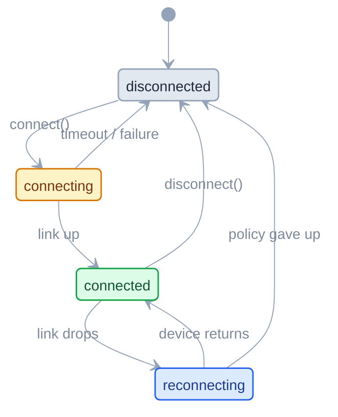

<div align="center">

# AsyncBLE

**CoreBluetooth for the central role, in Swift concurrency.**
No delegates, no `CBPeripheral` in your code, and a connection that survives
the device walking out of range.

[](https://github.com/vilimets/AsyncBLE-Swift/actions/workflows/ci.yml)
[](https://vilimets.github.io/AsyncBLE-Swift/documentation/asyncble/)
[](https://swift.org)
[](https://developer.apple.com/ios/)
[](https://swift.org/package-manager/)
[](LICENSE)

</div>

---

```swift
import AsyncBLE

let central = Central()

for await device in try await central.scan(services: [heartRate]) {
    let connection = try await central.connect(device)

    for try await beat in try await connection.notifications(for: HeartRate.measurement) {
        print(beat.beatsPerMinute)
    }
}
```

That loop keeps running when the strap goes out of range and comes back. You do not write the
reconnect, and you do not re-subscribe.

<details>
<summary><b>The same thing in plain CoreBluetooth</b> — seven callbacks, two force unwraps, and a resubscribe path most codebases get wrong</summary>

```swift
final class Monitor: NSObject, CBCentralManagerDelegate, CBPeripheralDelegate {
    private var central: CBCentralManager!
    private var peripheral: CBPeripheral?

    func start() { central = CBCentralManager(delegate: self, queue: nil) }

    func centralManagerDidUpdateState(_ c: CBCentralManager) {
        guard c.state == .poweredOn else { return }   // ...and if it never is?
        c.scanForPeripherals(withServices: [heartRate])
    }
    func centralManager(_ c: CBCentralManager, didDiscover p: CBPeripheral, ...) {
        peripheral = p                                // retain it or it deallocates
        p.delegate = self
        c.stopScan()
        c.connect(p)                                  // no timeout exists — hangs forever
    }
    func centralManager(_ c: CBCentralManager, didConnect p: CBPeripheral) {
        p.discoverServices([heartRate])               // two more callbacks to go
    }
    func peripheral(_ p: CBPeripheral, didDiscoverServices e: Error?) {
        p.discoverCharacteristics([measurement], for: p.services!.first!)
    }
    func peripheral(_ p: CBPeripheral, didDiscoverCharacteristicsFor s: CBService, ...) {
        p.setNotifyValue(true, for: s.characteristics!.first!)
    }
    func peripheral(_ p: CBPeripheral, didUpdateValueFor ch: CBCharacteristic, ...) {
        handle(ch.value)                              // finally
    }
    func centralManager(_ c: CBCentralManager, didDisconnectPeripheral p: CBPeripheral,
                        error: Error?) {
        // Was this the user, or the link? Same callback either way. And every
        // characteristic discovered above is now invalid, so on the way back you
        // get to run all four discovery callbacks again — assuming you kept enough
        // state to know which ones you were subscribed to.
        c.connect(p)
    }
}
```

</details>

## Contents

[Why](#why) · [Installation](#installation) · [Usage](#usage) · [Reconnection](#reconnection) ·
[Errors](#errors) · [Diagnostics](#diagnostics) · [Limits](#limits) ·
[Documentation](#documentation) · [Roadmap](#roadmap) · [Non-goals](#non-goals)

## Why

Three things are painful in every CoreBluetooth codebase, and every codebase solves them again
from scratch.

**Connection state is implicit.** It lives across a delegate, a couple of booleans, and a
comment apologising for both. AsyncBLE makes it one observable state machine, and nothing
changes it behind your back.

**Reconnection is hand-rolled.** CoreBluetooth already retries a pending connect indefinitely,
scheduled by the radio rather than by your app waking up to poll. What it never does is *tell
you what is happening*, or *give up*. AsyncBLE adds exactly those two things — and skips the
backoff loop everyone writes and nobody tests.

**Delegates fragment the logic.** A read is a method call over here and a callback on the other
side of the file. Here it is one `try await`.

## Installation

Add the package in Xcode via **File ▸ Add Package Dependencies**, or in `Package.swift`:

```swift
dependencies: [
    .package(url: "https://github.com/vilimets/AsyncBLE-Swift.git", from: "0.1.0")
]
```

```swift
.target(name: "MyApp", dependencies: [
    .product(name: "AsyncBLE", package: "AsyncBLE-Swift")
])
```

Then add **`NSBluetoothAlwaysUsageDescription`** to your `Info.plist`, with a sentence a user
would actually understand. Without the key the permission prompt never appears and every call
fails as `unauthorized` — it is the most common way to lose an afternoon here.

> Bluetooth does not work in the Simulator. Test on a device.

## Usage

### Scan

Filtering is strongly preferred: an unfiltered scan is much more expensive on battery, and it
does not work at all in the background.

```swift
let heartRate = ServiceID(string: "180D")

for await device in try await central.scan(services: [heartRate]) {
    print(device.name ?? "unnamed", device.rssi ?? 0)
}
```

The scan starts when you begin iterating and stops when you stop — breaking out, cancelling the
task, or dropping the stream all reach `stopScan()`. A scan that outlives its consumer is a
battery bug, so the library will not let one happen.

### Connect

```swift
let connection = try await central.connect(device, timeout: .seconds(5))
```

CoreBluetooth has no native connect timeout — a request against a device that is off stays
pending forever. `connect` imposes one. When waiting forever is genuinely what you want, say so:

```swift
// Resuming a known device at launch: no scan, no polling, no timer.
let connection = try await central.connectWhenInRange(savedPeripheralID)
```

Two callers connecting to the same peripheral get the **same** connection. A link is a
device-wide resource, not a per-caller session.

### Read, write, subscribe

```swift
let data = try await connection.read(measurement)

try await connection.write(Data([0x01]), to: controlPoint)                        // acknowledged
try await connection.write(chunk, to: controlPoint, mode: .withoutResponse)       // fire & forget

for try await value in try await connection.notifications(for: measurement) {
    print(value)
}
```

Service and characteristic discovery happens lazily on first use and is cached per link — you
address things by UUID and never walk a GATT tree. Reads and writes execute in call order
across every caller, through one FIFO per connection. Write-without-response applies flow
control rather than dropping packets on the floor.

### Give characteristics a type

Address by UUID and you get `Data`. Declare the characteristic once with the type it carries,
and the decoding follows every call site:

```swift
struct HeartRateMeasurement: CharacteristicDecodable {
    let beatsPerMinute: Int

    init(characteristicData data: Data) throws {
        guard let flags = data.first, data.count >= 2 else {
            throw CharacteristicDecodingError.unexpectedLength(expected: 2, actual: data.count)
        }
        beatsPerMinute = flags & 0x01 == 0
            ? Int(data[1])
            : Int(UInt16(data[1]) | UInt16(data[2]) << 8)
    }
}

enum HeartRate {
    static let measurement  = Characteristic<HeartRateMeasurement>("2A37")
    static let controlPoint = Characteristic<UInt8>("2A39")
}

try await connection.write(0x01, to: HeartRate.controlPoint)
let beat = try await connection.read(HeartRate.measurement)   // HeartRateMeasurement, not Data
```

`UInt8` through `Int64`, `String` and `Data` work out of the box. Typed calls *are* the untyped
ones with a codec wrapped around them — same ordering, same discovery, same reconnect
behaviour. Writing a `Command` to a characteristic that holds a `Measurement` stops compiling.

### Observe

```swift
for await state in connection.states {
    switch state {
    case .connected:              statusLabel.text = "Connected"
    case .connecting:             statusLabel.text = "Connecting…"
    case .reconnecting:           statusLabel.text = "Out of range — waiting"
    case .disconnected(let why):  statusLabel.text = "Disconnected \(why.map(String.init(describing:)) ?? "")"
    }
}
```

Bluetooth being switched off is a state to observe, not an exception to handle once:

```swift
for await state in central.adapterStates {
    banner.isHidden = (state == .poweredOn)
}
```

## Reconnection

This is the part worth reading if you are choosing between wrappers.

A dropped link does **not** end the connection. It moves to `reconnecting` and keeps its
identity — your `Connection` reference stays valid, and your notification subscriptions come
back on their own when the device returns. The library flushes the invalidated GATT objects,
re-walks discovery on the new link, and re-subscribes. Nothing in your code participates.



A user-initiated `disconnect()` is a *different transition* from a dropped link, so it never
triggers a reconnect wait — CoreBluetooth reports both through the same delegate callback, and
telling them apart is what makes the rest of this work.

The policy decides one thing only: when to stop waiting.

```swift
Central(configuration: .init(reconnectPolicy: .waitIndefinitely()))   // default
Central(configuration: .init(reconnectPolicy: .giveUp(after: .seconds(30))))
Central(configuration: .init(reconnectPolicy: .never))
```

The default waits forever because the OS holds the pending connect at no cost, and a bounded
default mostly serves to give up on devices that were about to come back. There is no backoff
curve and no attempt counter, because there is nothing to retry: one request is in flight the
whole time. While reconnecting, reads and writes **fail fast** rather than queueing up behind
an outage.

## Errors

One error type, so a single `catch` covers the API — and the cases are the ones you would
actually branch on:

```swift
do {
    let connection = try await central.connect(peripheralID, timeout: .seconds(3))
} catch BluetoothError.bluetoothUnavailable(reason: .poweredOff) {
    show("Turn on Bluetooth to continue.")
} catch BluetoothError.bluetoothUnavailable(reason: .unauthorized) {
    show("Allow Bluetooth in Settings.")
} catch BluetoothError.connectTimeout {
    show("Device did not respond. Is it awake and in range?")
}
```

## Diagnostics

Logs to OSLog at `notice` by default — connects, disconnects, reconnection decisions, adapter
changes. Configured once at init; there is no runtime setter.

```swift
Central()                                        // default
Central(logging: .init(minimumLevel: .debug))    // per-callback tracing
Central(logging: .init(handler: MyLogHandler())) // your own sink
Central(logging: .disabled)                      // off
```

```bash
log stream --predicate 'subsystem == "com.asyncble"' --level debug
```

Six categories — `central`, `connection`, `io`, `gatt`, `reconnect`, `bridge` — so you can
narrow to just reconnection, or just the raw CoreBluetooth callbacks. Characteristic payload
bytes are never logged; identifiers are, since they are random per-app values.

## Limits

**No CoreBluetooth in your code.** Its types stay out of the public API, with two deliberate
exceptions: `CBUUID` as an identifier — spelled `ServiceID` and `CharacteristicID` for the role
it is playing — and the objects handed to you inside `withRaw`. The example app has no
`import CoreBluetooth`, and a test guards that.

**An escape hatch, for what this does not wrap yet:**

```swift
let mtu = await connection.withRaw { peripheral, _ in
    peripheral.maximumWriteValueLength(for: .withoutResponse)
}
```

The closure runs on the library's own queue, which is what makes touching these objects safe
rather than a data race with a reassuring comment. Synchronous inspection works.
**Callback-based CoreBluetooth calls do not** — `readRSSI()`, descriptor I/O and L2CAP deliver
their results to the library's delegate, so they appear to succeed and the result is dropped.
Those need real API support; see the [roadmap](#roadmap).

**A link nobody closes stays open.** Dropping your last reference does not disconnect —
`Central.activeConnections` and `Central.disconnectAll()` are how you find and close one.

## Documentation

**[📖 Full API reference and articles](https://vilimets.github.io/AsyncBLE-Swift/documentation/asyncble/)** — published from `main` on every push.

| Article | What it covers |
|---|---|
| [Getting started](https://vilimets.github.io/AsyncBLE-Swift/documentation/asyncble/gettingstarted/) | Install, permissions, and a session end to end |
| [Connection lifecycle](https://vilimets.github.io/AsyncBLE-Swift/documentation/asyncble/connectionlifecycle/) | The four states and every transition between them |
| [Reconnection](https://vilimets.github.io/AsyncBLE-Swift/documentation/asyncble/reconnection/) | What happens after a link drops, and how to bound it |
| [Logging and diagnostics](https://vilimets.github.io/AsyncBLE-Swift/documentation/asyncble/diagnostics/) | Levels, categories, and redirecting the output |
| [Using the escape hatch](https://vilimets.github.io/AsyncBLE-Swift/documentation/asyncble/escapehatch/) | Reaching CoreBluetooth directly, and what that cannot do |

To read it offline, use **Product ▸ Build Documentation** (⌃⇧⌘D) in Xcode.

[`Example/`](Example/) is a small SwiftUI app — scan list, connect, live characteristic value —
and the fastest way to see the shape of a session.

**Tested on real devices, and in CI without them.** The reconnect and subscription-restore
paths — the ones that matter and the ones you cannot fake convincingly — are exercised against
actual BLE peripherals: connect, walk out of range, walk back, confirm the notification stream
never broke. On top of that sit over 230 automated tests that need no hardware, so every push
is checked: the state machine is pure and driven by synthetic events, and an internal protocol
seam puts the delegate bridge, discovery cache and I/O queue under test against fakes.

## Roadmap

Not in 0.1.0, in rough priority order:

- RSSI read and monitoring — nothing covers it today, so it is first in line
- Background modes and state restoration
- Descriptor read/write
- L2CAP channels
- Multi-device connection helpers
- A Combine adapter over the `AsyncStream`s
- A public protocol abstraction over `Central`, for consumer mock-injection
- macOS / watchOS / tvOS / visionOS

## Non-goals

Permanently out of scope. These are not "later", they are "no":

- **Peripheral role** — advertising, GATT server
- **Classic Bluetooth / MFi**
- **Objective-C compatibility**

## Contributing

AsyncBLE is deliberately small. Read [CONTRIBUTING.md](CONTRIBUTING.md), plus the
[Roadmap](#roadmap) and [Non-goals](#non-goals), before opening a pull request.

## License

MIT — see [LICENSE](LICENSE).
